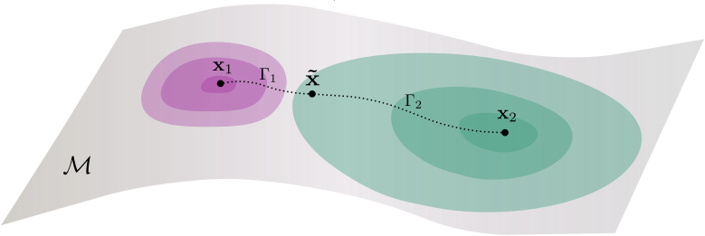

# Fermat distance
Fermat is a Python library that computes the Fermat distance estimator (also called d-distance estimator) proposed in _Weighted Geodesic Distance Following Fermat's Principle_ (see https://openreview.net/pdf?id=BJfaMIJwG).


### Table of contents

1. [Introduction](#introduction)
2. [Instalation](#instalation)
3. [Implementation](#implementation)
4. [Features](#features)
5. [Support](#support)
6. [Citting Fermat distance](#licence)
  

### Introduction

A density-based estimator for weighted geodesic distances is proposed.
Let M be a D-dimensional manifold and consider a sample of N points X_n living in M. Let l(.,.) be a distance defined 
in M (a typical choice could be Euclidean distance). For d>=1 and given two points p and q in M we define the Fermat 
distance estimator as 


The minimization is done over all K>=2 and all finite sequences of data points with x1= argmin l(x,p) 
and xK = argmin l(x,q).

When d=1, we recover the distance l(.,.) but if d>1, the Fermat distance tends to follow more closely the manifold 
structure and regions with high density values.


 


### Installation

You can import Fermat directly from the folder where you have the repository. For example

```python
import sys
sys.path.append(path_to_FermatFolder)
from fermat import Fermat
```

However, if you are working on Ubuntu (or any similar distribution) you can install the `Fermat package` running the following command in a terminal 

`python3 setup.py build && sudo python3 setup.py install`


### Implementation


The optimization performed to compute the Fermat distance estimator runs all over the possible paths of points between each pair of points. We implement an algorithm that computes the exact Fermat distance and two that compute approximations.

#### Exact: Floyd-Warshall
Permorf the _Floyd-Warshall algorithm_ that gives the exact Fermat distance estimator in `O( n^3 )` operations between all possible paths that conects each pair of points.

#### Aprox: Dijsktra + k-nearest neighbours
  
With probability arbitrary high we can restrict the minimum path search to paths where each consecutive pair of points are k-nearest neighbours, with `k = O(log n)`. Then, we use _Dijkstra algorithm_ on the graph of k-nearest neighbours from each point. The complexity is `O( n * ( k * n * log n ) )`.

#### Aprox: Landmarks
If the number of points n is too high and neither Floyd-Warshall and Dijkstra run in appropiate times, we implemente a gready version based on landmarks. Let consider a set of l of point in the data set (the landmarks) and denote `s_j` the distance of the point `s` to the landmark `j`. Then, we can bound the distance `d(s,t)` between any two points `s` and `t` as

`lower = max_j { | s_j - t_j | } <= d(s,t) <= min_j { s_j + t_j } = upper`

and estimate `d(s,t)` as a function of `lower` and `upper` (for example, `d(s,t) ~ (_lower + upper_) / 2` ). The complexity is `O( l * ( k * n * log n ) )`.


### Features

- Exact and approximate algorithms to compute the Fermat distance.
- Examples explaining how to use this package.
    * [Quick start] 
    * [MNIST data set]
- [Documentation]

### Support

If you have an open-ended or a research question:
-  `'f.sapienza@aristas.com.ar'`

### Citting Fermat distance

When [citing fermat in academic papers and theses], please use this
BibTeX entry:

    @inproceedings{
          sapienza2018weighted,
          title={Weighted Geodesic Distance Following Fermat's Principle},
          author={Facundo Sapienza and Pablo Groisman and Matthieu Jonckheere},
          year={2018},
          url={https://openreview.net/forum?id=BJfaMIJwG}
    }

[Quick start]:https://github.com/facusapienza21/Fermat-distance/blob/master/examples/Fermat_quick_start.ipynb
[citing fermat in academic papers and theses]:https://scholar.google.com/citations?user=yWj-T4oAAAAJ&hl=en#d=gs_md_cita-d&p=&u=%2Fcitations%3Fview_op%3Dview_citation%26hl%3Den%26user%3DyWj-T4oAAAAJ%26citation_for_view%3DyWj-T4oAAAAJ%3Au5HHmVD_uO8C%26tzom%3D180
[Documentation]:https://github.com/facusapienza21/Fermat-distance/blob/master/DOCUMENTATION.md
[MNIST data set]: https://github.com/facusapienza21/Fermat-distance/blob/master/examples/MNIST_example.ipynb
